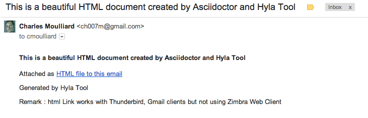

:toc:
:data-uri:
:linkattrs:
:sectanchors:
:setlinks:

toc::[]

== Introduction

image:https://raw.github.com/cmoulliard/hyla/master/documentation/image/hyla_frog.jpg[Hyla, 100, 100, role="left"] **Hyla** is a Ruby command line tool to create a new
documentation/training/blog/static web site project, add artefacts (articles, blog, audio, video, content, code source, ...), render it in HTML, SlideShow, ... using asciidoc(tor) as markup language.

Until now, hyla looks like asciidoctor client but is is more similar to Jekyll on the principle but here we support 'asciidoc, asciidoctor' formats and not markdown.

The tool allows to :

- Generate slideshow presentations (deckJs, RevealJS) - https://twitter.com/cmoulliard/status/421587832159756288,
- Setup a blank project,
- Setup a project from template (book, training, training-exercises, documentation/training content, ...
- Create a documentation/training project (including directories + files) from a Table of Content
- Generate a one HTML file (= sum of all the asciidoc files) for slideshow (or trainer presentation) using index files (= file containing links to include other files)
- Render html content from asciidoc (http://asciidoctor.org/docs/user-manual)
- Render html using different styles
- Watch files (LiveReload - WebSocket) and render them if a modification has been detected or file added
...

It is not a replacement or a concurrent of 'awestruct'. Idea is to package in hyla css styles, backends, samples (article, image, table, audio, video, book, report)
and collection of templates (blog, static web site, awestruct, training, documentation = collection of modules, ... ) to boost process to develop documentation,
training content (reason why hyla will assist you to create from a Table of content the structure of directories + asciidoc files (a file = a chapter =a module)),
blog web, book, articles, static web site site ... without the need to install git projects (everything is packaged in one tool like jekyll).

Reason / Motivation about the packaging : many end users are not developers/engineers and they enjoy to have one tool to use and not a procedure they should clone git repo, build, copy resources manually
to finally build a documentation/training/blog ....

hyla should be released regularly and will contain last releases of styles/backends/awestructs ...
hyla will reuse stylesheets created from 'asciidoctor-stylesheet-factory' and 'asciidoctor-backends' for HTML5, RevealJS, DeckJS, DockBook ...
hyla will include 'awestruct'

The Hyla project name comes from an arboreal http://en.wikipedia.org/wiki/Hyla[frog] living in equatorial regions of Europe, Asia or Americas. Its name was inspired by the companion of Hercule (Hylas) in Greek mythology.

== Prerequisites

- https://github.com/sstephenson/ruby-build#readme[rbenv-build] which let you to deploy a pre-compiled version of Ruby
- https://github.com/sstephenson/rbenv[rbenv] to manage different versions of Ruby
- https://www.ruby-lang.org/en/[Ruby] 1.9.3-p484
- http://guides.rubygems.org/[RubyGems] to install Ruby Applications
- http://feedback.livereload.com/knowledgebase/articles/86242-how-do-i-install-and-use-the-browser-extensions-[How do I install and use the browser extensions for LiveReload].
Be sure to enable the option “Allow access to file URLs” checkbox in Tools > Extensions > LiveReload after installation of Chrome Extension.

image::image/access_local_file.png[Access Local File,650,150]

== Installation

Use `gem install` command to deploy Hyla :

    $ gem install hyla -y -v 1.0.x

NOTE : The option `-y` will tell to rubyGems to deploy the gem but also the dependencies required

NOTE : The option `-v` tells to gem installer to deploy a specific version / release. The release number will depend on the version available (1.0.1, 1.0.2, ...)

An alternative is to create a Gemfile and add this line :

    gem 'hyla'

And then execute:

    $ bundle

**Or** install it yourself as:

    $ gem install hyla -v _version_

where _version_ should be 1.0.2, 1.0.x

== For Developer's only

    Clone Git project locally, move to Hyla directory and execute the following commands
    gem build hyla.gemspec
    gem install hyla-1.0.x

== To publish Hyla to Gem Repo

    gem build hyla.gemspec
    gem install hyla-1.0.x.gem
    gem push hyla-1.0.x.gem

== Usage

Open a terminal and move to the folder where you would like to create a new project or develop an existing. As Hyla is command line tool, it will be used with one of the following commands :

    create               Creates a new file from asciidoc artefacts for an existing project
    generate             Generate modules and asciidoc files from an asciidoc Table Of Content file
    help                 Display global or [command] help documentation.
    new                  Creates a new Hyla project using a template or blank to the PATH specified
    serve                Serve locally your site
    watch                Watch directories for any change, add or file deleted and render document (HTML5)

More info about options and commands available can be find by running the `command line tool`

    hyla --help

== Scenario

The following scenario describes how we can can setup a project using one of the option proposed by Hyla : Create, Generate, Watch, ...

==== 1. Delete Temp directory

    rm -rf ~/hyla/MyBlankProject/
    rm -rf ~/hyla/MyBookProject
    rm -rf ~/hyla/MyPdfProject/
    rm -rf ~/hyla/MyTocProject/
    rm -rf ~/hyla/MyTrainingProject/
    rm -rf ~/hyla/MyTrainingExercisesProject/
    rm -rf ~/hyla/MyDeckSlideShow/
    rm -rf ~/hyla/MyRevealSlideShow/
    rm -rf ~/hyla/MyEmailProject/

== 1. Blank Project & Artefacts

Using hyla we will create a new project (= directory) and add artefacts (article, audio, video, image, source, table)

== 1. Create a Blank Project (with or without --force option)

    hyla new --blank ~/hyla/MyBlankProject
    hyla new --blank ~/hyla/MyBlankProject --force

== 2. Create a Blank Project without _config.yaml config file, add artefact

- Clean and create a MyBlankProject (= directory) using --force option

    cd ~/hyla
    rm -rf MyBlankProject/
    hyla new --blank MyBlankProject --force

- Create Asciidoc files from samples (book, article, image, audio, ...)

    hyla create --t asciidoc -a article -d ~/hyla/MyBlankProject
    hyla create --t asciidoc -a book -d ~/hyla/MyBlankProject
    hyla create --t asciidoc -a image -d ~/hyla/MyBlankProject
    hyla create --t asciidoc -a audio -d ~/hyla/MyBlankProject
    hyla create --t asciidoc -a video -d ~/hyla/MyBlankProject
    hyla create --t asciidoc -a source -d ~/hyla/MyBlankProject
    hyla create --t asciidoc -a table -d ~/hyla/MyBlankProject

== 3.  Create a Blank Project using _config.yaml config file, add artefacts

- Clean up project and create a MyBlankProject (= directory) using --force option

    cd ~/hyla
    rm -rf MyBlankProject/

    # Create a Blank project but containing the yaml config file
    hyla new --blank MyBlankProject --force

    cd MyBlankProject

- Create Asciidoc files from samples (book, article, image, audio, ...)

    hyla create --a article
    hyla create --a book
    hyla create --a image
    hyla create --a audio
    hyla create --a video
    hyla create --a source
    hyla create --a table

=== 4. Generate HTML Content of an existing project (asciidoc 2 html)

    hyla generate -r adoc2html -s ~/hyla/MyBlankProject/ -d ~/hyla/MyBlankProject/generated_content

=== 5. Generate HTML Content of an existing project (asciidoc 2 html) with a different style

    Styles available : liberation, asciidoctor, colony, foundation, foundation-lime, foundation-potion, github, golo, iconic, maker, readthedocs, riak, rocket-panda, rubygems

    hyla generate -r adoc2html -s ~/hyla/MyBlankProject/ -d ~/hyla/MyBlankProject/generated_content --style liberation
    hyla generate -r adoc2html -s ~/hyla/MyBlankProject/ -d ~/hyla/MyBlankProject/generated_content --style github
    hyla generate -r adoc2html -s ~/hyla/MyBlankProject/ -d ~/hyla/MyBlankProject/generated_content --style foundation

=== 6. Generate HTML Content within project

    hyla generate -r adoc2html -s . -d generated_content

=== 7. Generate HTML Content within project & using Config File

   As destination directory is not longer '.' (which is the case when we add artefacts using `hyla create` command, then we must change the destination directory to `generated_content`. the original file is
   still available as it will backup by ruby

    ruby -i.bak -pe 'sub(%r{destination: .},"destination: generated_content")' _config.yaml
    hyla generate
    hyla generate -y foundation

== 2. Project from Template

=== 1. Create a project using a template (training)

    cd ~/hyla
    hyla new --t training MyTrainingProject

    // TODO Refactor Training Exercises Template
    hyla new --t training-exercises MyTrainingExercisesProject

    // TODO - Add images
    hyla new --t book MyBookProject

=== 2. Generate content and watch it

    cd ~/hyla/MyTrainingProject
    ruby -i.bak -pe 'sub(%r{destination: .},"destination: generated_content")' _config.yaml
    hyla generate

    hyla watch -s ~/hyla/MyTrainingProject/ -d ~/hyla/MyTrainingProject/generated_content

== 3. Table Of Content To asciidoc

=== 1. Generate an asciidoctor project from a Table of Content

The entry point of a Documentation site, Training, Publication or Book will consist most of the time to create
a Table Of Content which is a collection of modules with chapters that we will develop. As this process to elaborate
the structure of the project will consume lot of time/effort, Hyla will simplify your life as it allows from a TOC file

    = A. Introduction module
    >> This is the module 'A. Introduction'
    == 1. Chapter
    This is a chapter about ...
    == 2. Chapter
    This is a Chapter about ...
    === 2.1. Section
    ...
    = B. Instruction module
    >> This is the module 'B. Instruction module'
    == 1. Chapter
    This is a Chapter about ...`

to generate a collection of folders (= modules) containing files which represent the chapters (== Titles of the TOC ).
For each module (= Module), an index file is also created including the files listed in a module. That can be serve to generate a
slideshow presentation using as backend (DeckJS, DZSlides, ...) later on.

- Delete existing project

    cd ~/hyla
    rm -rf MyTocProject/

- Generate asciidoc files from a Table Of Content (= collection of folders and files) and next HTML

    hyla generate -r toc2adoc -p my-project -d ~/hyla/MyTocProject/ --toc ~/MyProjects/hyla/data/toc.adoc
    hyla generate -r adoc2html -s ~/hyla/MyTocProject/ -d ~/hyla/MyTocProject/generated_content

Example about what is generated

    >> Project Name : my-project <<
    >> Directory created : ~/hyla/MyTocProject/A_Introduction_module <<
       = File created : 1_Chapter
       = File created : 2_Chapter
       = File created : 3_Chapter
    >> Directory created : ~/Temp/MyTocProject/B_Instruction_module <<
       = File created : 1_Chapter
    >> Directory created : /Temp/MyTocProject/C_Installation_module <<
       = File created : 1_Chapter
       = File created : 2_Chapter

- Watch asciidoc files and generate new HTML content when a modification is detected

While you develop asciidoc(tor) documents, it is interesting to consult the files rendered in HTML. Hyla supports such option with LiverReload
as a WebSocket server is exposed for the browser. To watch files and let's asciidoctor to render them, simply open a terminal and provide as
 parameter the source directory containing the files to be watched.

    hyla watch -s ~/hyla/MyTocProject/ -d ~/hyla/MyTocProject/generated_content

=== 2. Generate an asciidoctor project from a Table of Content using YAML config file and watch content

    rm -rf ~/hyla/MyTocProject
    cd ~/hyla
    hyla new --blank MyTocProject
    cd MyTocProject
    hyla generate --r toc2adoc

    # Change destination in config files or pass info as option
    # cd ../MyTocProject/
    # subl _config.yaml
    hyla generate -r adoc2html

    hyla watch -s ~/hyla/MyTocProject/ -d generated_content

=== 3. Generate a DeckJS Slideshow for a module

    cd ~/hyla/MyTocProject
    hyla generate --backend deckjs -s  A_Introduction_module/ -d A_Introduction_module/generated_content -r index2html

=== 4. Generate a DeckJS Slideshow for a Project (all the TOC)

    cd ~/hyla/MyTocProject
    hyla generate --backend deckjs -s  . -d generated_content -r index2html

== 5. Server content locally - HTTP Server

To simplify your life, a simple HTTP Server can be started by Hyla and will allow to consult/browse HTML files generated. In this case, start this
Hyla command in another Terminal

    hyla serve -P 4000 -H localhost -b /hyla/ --out_dir ~/hyla/MyTrainingProject/generated_content/

== 6. Generate a Slideshow

=== 1. DeckJS

    rm -rf  ~/hyla/MyDeckSlideShow
    cd ~/hyla
    hyla new -b -d MyDeckSlideShow

   hyla create --t slideshow -a deckjs -d MyDeckSlideShow
   hyla generate --backend deckjs -s  ~/hyla/MyDeckSlideShow -d ~/hyla/MyDeckSlideShow/generated_content -r adoc2html

=== 2. Different DeckJS Style options

    hyla generate --backend deckjs -s  ~/hyla/MyDeckSlideShow -d ~/hyla/MyDeckSlideShow/generated_content -r adoc2html -a deckjs_theme=swiss,deckjs_transition=fade
    hyla generate --backend deckjs -s  ~/hyla/MyDeckSlideShow -d ~/hyla/MyDeckSlideShow/generated_content -r adoc2html -a deckjs_theme=web-2.0,deckjs_transition=horizontal-slide

===  3. RevealJS

    rm -rf ~/hyla/MyRevealSlideShow
    cd ~/hyla
    hyla new --blank -d MyRevealSlideShow

    hyla create --t slideshow -a revealjs -d MyRevealSlideShow

    cd MyRevealSlideShow

    hyla generate --backend revealjs -s . -d generated_content -r adoc2html

    open http://localhost:4000/hyla/slideshow_revealjs.html &

    hyla serve -P 4000 -H localhost -b /hyla/ -d generated_content/

== 7. Generate a PDF

A PDF document can be created using the rendering option `html2pdf`. To render the HTML file, Hyla uses the following Ruby
libraries https://github.com/pdfkit/pdfkit[pdfkit] and https://github.com/wkhtmltopdf/wkhtmltopdf[wkhtmltopdf].

- Clean and create a MyPdfProject (= directory)

    cd ~/hyla
    rm -rf MyPdfroject/
    hyla new -b -d MyPdfProject --force
    cd MyPdfProject

- Create Asciidoc file from sample (book)

    hyla create -a book --t asciidoc -d .

- Generate HTML content using foundation stylesheet

    hyla generate --style foundation

- We change the rendering from adoc2html to html2pdf

    ruby -i.bak -pe 'sub(%r{rendering: adoc2html},"rendering: html2pdf")' _config.yaml

- Source directory & Destination directory

    ruby -i.bak -pe 'sub(%r{source: .},"source: ./generated_content")' _config.yaml
    ruby -i.bak -pe 'sub(%r{destination: generated_content},"destination: ./generated_content/pdf")' _config.yaml

- We will generate the PDF file for the image and book

    hyla generate -f asciidoc_book.html
    hyla generate -f asciidoc_image.html

- Result can be opened and viewed

    open generated_content/pdf/asciidoc_book.pdf
    open generated_content/pdf/asciidoc_image.pdf

== 7. Send Email

An email can be created using as attachment an HTML file based on the information, parameters provided into the
_config.yaml file. These parameters will allow to populate the email message and add as attachment the HTML
file generated from an asciidoc file.

    email_attributes:
        from:     "Charles Moulliard <ch007m@gmail.com>"
        to:       'cmoulliard@apache.com'
        subject:  "This is a beautiful HTML document created by Asciidoctor and Hyla Tool"
        # GMAIL
        smtp_server:      'smtp.gmail.com'
        port:             '587'
        enable_starttls:  'true'
        user:             'your_gmail_user'
        password:         'your_gmail_password!'

Two new options are required to process the request on the command line or using _config.yaml file

    location: ./generated_content
    file: name_of_html_file

- Create a Blank project

    cd ~/hyla
    rm -rf MyEmailProject/
    hyla new -b -d MyEmailProject --force
    cd MyEmailProject

- Add an asciidoc file (report, doc, book, article)

    hyla create --a book --d .

- Edit the _config.yaml file and add the parameters required (see previously)

- Generate HTML content using foundation stylesheet

    hyla generate --style asciidoctor

- Send email to the SMTP server defined

   hyla sendmail

- Consult the message received in your mailbox

