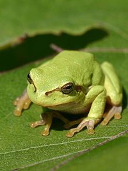

:icons: font
:data-uri:

== Asciidoc(tor) Reference

- http://asciidoctor.org/docs/user-manual/#images[Images]

== A block centered image with subtitle, id and link to refer

[[id_of_hyla_picture]]
.Title of the picture displayed under the picture

[.text-center]
Link to Figure Image : <<id_of_hyla_picture,A beautiful Hyla Arborea Picture>>

== A block image pulled to the right and centered within the block

== An inline image pulled to the left of the paragraph text

You can find Hyla in American, Europe or Asian Tropical Rain forrests !

== A hyperlinked image with caption
[[img-sunset]]
.A mountain sunset

